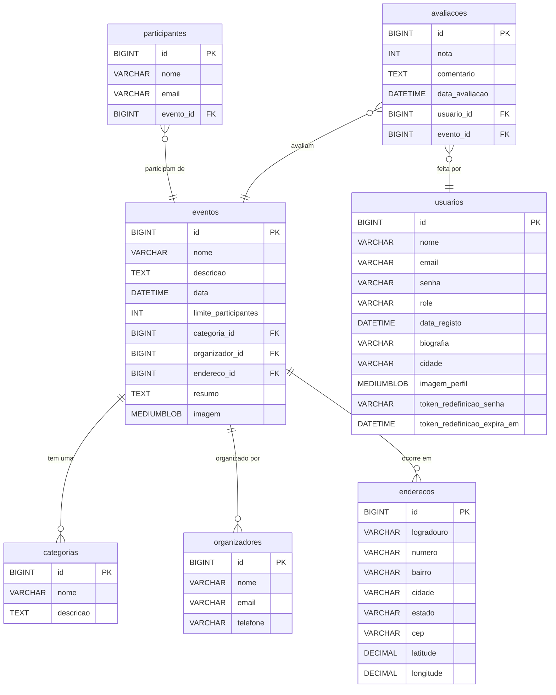

# FER - Fundação de Eventos Regionais

Um projeto de Web Services para a disciplina do Centro Universitário de Excelência ENIAC.

---

## 📜 Sobre o Projeto

**FER (Fundação de Eventos Regionais)** é uma API RESTful completa e inteligente, construída com **Spring Boot**, que serve como a base para uma plataforma de gestão e divulgação de eventos comunitários, culturais e desportivos.

A API permite que organizadores criem e administrem seus eventos, que participantes se inscrevam e interajam, e que administradores gerenciem a plataforma. O projeto foi enriquecido com funcionalidades avançadas como busca por geolocalização, notificações por e-mail, e um módulo de IA para moderação e geração de conteúdo usando Spring AI com Ollama.

---

## ✨ Funcionalidades Principais

- **Gestão Completa de Eventos**: CRUD completo para eventos, categorias e organizadores.
- **Sistema de Inscrições**: Permite que participantes se inscrevam em eventos com controle de vagas.
- **Segurança Robusta**: Autenticação baseada em Tokens JWT e autorização granular baseada em cargos (ADMIN, ORGANIZADOR, PARTICIPANTE).
- **Gestão de Utilizadores**:
  - Fluxo de registro e login.
  - Funcionalidade de "Esqueci a Senha".
  - Painel de administrador para gerir os cargos dos utilizadores.
  - Perfil de utilizador personalizável com foto, biografia e cidade.
- **Busca por Proximidade**: Endpoint para encontrar eventos próximos a uma dada coordenada (latitude/longitude).
- **Gestão de Mídia**: Upload de imagens para eventos e fotos de perfil, com armazenamento em BLOB no banco de dados.
- **Notificações Automáticas**:
  - E-mail de confirmação de inscrição.
  - Lembretes automáticos para eventos que acontecerão no dia seguinte.
- **Interatividade e Gamificação**:
  - Sistema de avaliações (notas e comentários) para eventos.
  - Rankings públicos de organizadores e participantes mais ativos.
- **Relatórios e Integrações**:
  - Exportação da lista de inscritos para CSV.
  - Exportação de eventos para o formato iCalendar (.ics).
- **Inteligência Artificial (Spring AI + Ollama)**:
  - Moderação automática de conteúdo para descrições de eventos.
  - Geração automática de resumos para eventos.

---

## 🛠️ Tecnologias Utilizadas

- **Backend**: Spring Boot, Spring Web, Spring Security, Spring Data JPA
- **Inteligência Artificial**: Spring AI, Ollama
- **Banco de Dados**: MySQL com Flyway para migrações
- **Autenticação**: JSON Web Tokens (JWT)
- **Bibliotecas Principais**: Lombok, OpenCSV, iCal4j
- **Documentação**: SpringDoc (Swagger UI)
- **Build**: Maven

---

## 📋 Requisitos para Funcionar

Para clonar e executar este projeto localmente, você precisará dos seguintes requisitos:

### Software

- **Java Development Kit (JDK)**: Versão 24 ou superior.
- **Apache Maven**: Versão 3.8 ou superior.
- **MySQL**: Um servidor de banco de dados MySQL a correr localmente ou acessível.
- **Ollama**: A aplicação Ollama deve estar instalada e a correr em segundo plano.  
  Pode ser descarregada em: [https://ollama.com/](https://ollama.com/).

### Hardware (Recomendado para IA)

- **CPU**: Um processador moderno (ex: Ryzen 5, Intel Core i5 ou superior).
- **RAM**: Pelo menos 16 GB para executar os modelos de IA (como o phi3) de forma confortável.

### Serviços Externos

- **Conta Resend**: É necessária uma chave de API do Resend para o envio de e-mails.

---

## 🚀 Como Executar o Projeto

### 1. Clone o Repositório

```bash
git clone https://github.com/seu-usuario/seu-repositorio.git
cd seu-repositorio
```

### 2. Configure o Banco de Dados

- Crie uma base de dados no seu MySQL (ex: `eventos_db`).
- Abra o ficheiro `src/main/resources/application.properties`.
- Altere as seguintes propriedades para corresponder à sua configuração do MySQL:

```properties
spring.datasource.url=jdbc:mysql://localhost:3306/eventos_db
spring.datasource.username=seu_usuario_mysql
spring.datasource.password=sua_senha_mysql
```

### 3. Configure os Serviços Externos

No mesmo ficheiro `application.properties`, adicione as suas chaves de API e configure a IA:

```properties
# Chave de API para o serviço de e-mails
resend.api.key=re_SUA_CHAVE_DO_RESEND

# Configuração do Spring AI para o Ollama
spring.ai.ollama.base-url=http://localhost:11434
spring.ai.ollama.chat.model=phi3
spring.ai.ollama.enabled=true # Mude para 'false' para rodar sem IA
```

### 4. Execute o Ollama e Descarregue o Modelo

Certifique-se de que a aplicação Ollama está a ser executada.

No seu terminal, descarregue o modelo que a nossa API está configurada para usar:

```bash
ollama pull phi3
```

### 5. Execute a Aplicação

No seu terminal, na raiz do projeto, execute o comando Maven:

```bash
mvn spring-boot:run
```

O Flyway irá criar automaticamente todas as tabelas na sua base de dados na primeira vez que arrancar.

---

## 📖 Uso da API

Após o arranque, a API estará acessível em [http://localhost:8080](http://localhost:8080).

### Documentação Interativa (Swagger UI)

A forma mais fácil de explorar e testar a API é através da documentação do Swagger, disponível em:  
[http://localhost:8080/swagger-ui.html](http://localhost:8080/swagger-ui.html)

### Fluxo de Autenticação

1. Crie um utilizador através do endpoint `POST /auth/registrar`.
2. Faça login com esse utilizador em `POST /auth/login` para obter um token JWT.
3. No Swagger UI, clique no botão "Authorize" e cole o seu token (no formato `Bearer <seu_token>`) para aceder aos endpoints protegidos.

---

## 🏛️ Estrutura do Banco de Dados

O diagrama abaixo representa a estrutura final da nossa base de dados.

---

## 👥 Contribuidores
Fernando Luiz Jasse Paulino Ramalho

---
